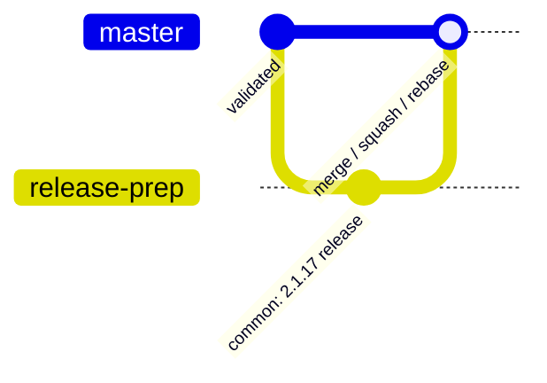
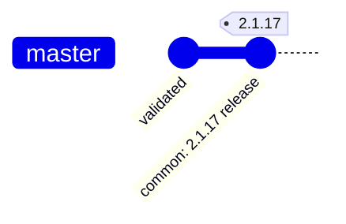
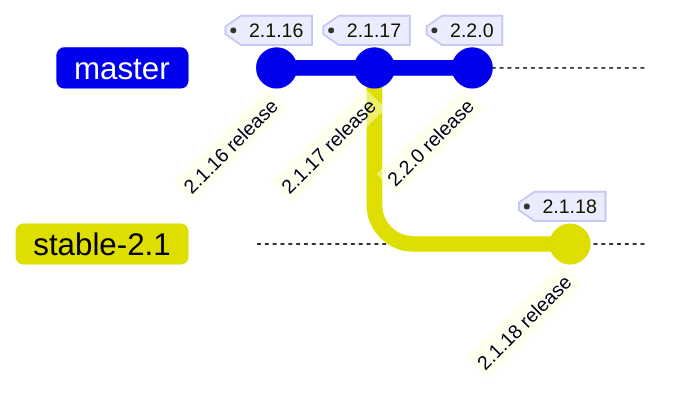

# PMDK release steps

This document contains all the steps required to make a new release of PMDK.

Export these two variables in your bash with the version of the release you want to create:

```bash
export VERSION=2.0.1-rc1   # the full version of the new release; include -rc1 as necessary
export VER=2.0             # just major.minor of the version
```

# 1. Validation

Make sure the version of PMDK you want to release has undergone a complete validation cycle successfully.

# 2. Changelog

Update [ChangeLog](ChangeLog):

- remember to change the day of the week in the release date
- for major releases mention compatibility with the N-1 major release, if needed

```bash
git add ChangeLog
git commit -a -m "common: $VERSION release"
```

Create a pull request to the appropriate branch. Please see [branching](#branching).

Review and land as usual.



**Note**: No validation before or after the landing of this pull request is necessary since it is only a change in ChangeLog.

# 3. Tagging

**Note**: It is required to sign the tag to prove the release was authorized (`-s` parameter in the command below).

Create and publish the tag:

```bash
git checkout master
git fetch origin
git reset --hard origin/master
git tag -a -s -m "PMDK Version $VERSION" $VERSION
git push origin $VERSION
```



# 4. Release

Go to [GitHub's releases tab](https://github.com/daos-stack/pmdk/releases/new) and fill in the form:

- tag version: $VERSION,
- release title: PMDK Version $VERSION,
- description: copy entry from the ChangeLog

# Extras

## Branching

There is no need to branch off as long as there is no need to release a patch release X.Y.Z after X.(Y+1).0 was already released. Otherwise you can keep releasing on the master branch.



**Note**: On the stable-$VER branch, bump the version of Docker images (`utils/docker/images/set-images-version.sh`) to $VER.

## GPG

If you require to generate a GPG key follow [these steps](https://docs.github.com/en/authentication/managing-commit-signature-verification/generating-a-new-gpg-key).
After that you'd also have to add this new key to your GitHub account - please follow the steps in
[this guide](https://docs.github.com/en/authentication/managing-commit-signature-verification/telling-git-about-your-signing-key).

## Release candidates

There is no need to create a release candidate as long as there is no extra pre-release validation which has to be conducted outside of the normal validation cycles (daily / weekly).
