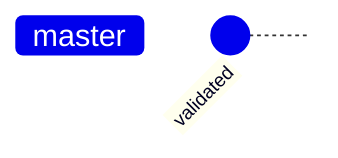
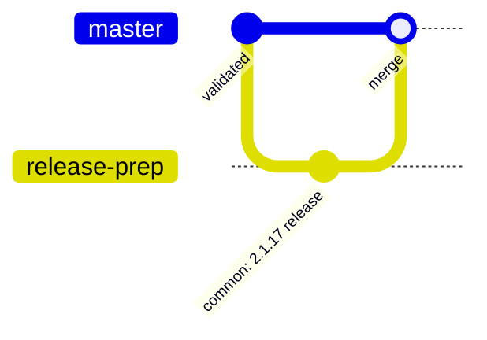
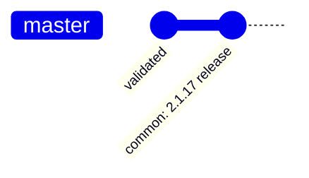
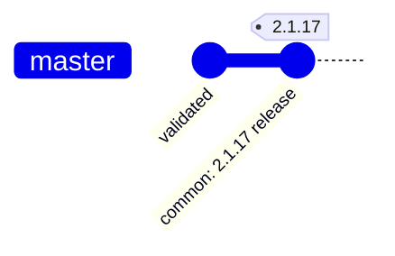
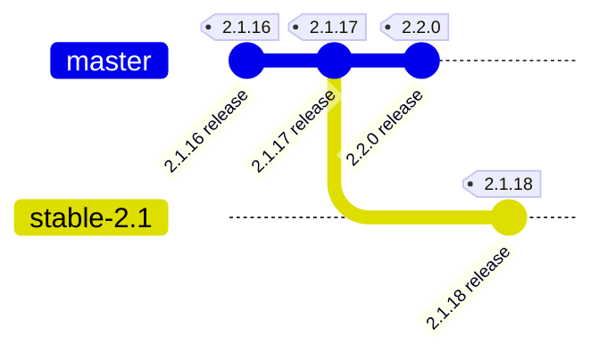

# PMDK release procedure

This document sets out the procedure for making a new release of PMDK. It assumes no other changes will get landed while the release procedure is ongoing. Make sure other team members are aware the release procedure has begun.

**Note**: The procedure assumes you are making a release on the master branch. Please see [branching](#branching) to see why this assumption is in place. If it is not the case please adjust as necessary.

Export these two variables in your bash with the version of the release you want to create:

```bash
export VERSION=2.0.1   # the full version of the new release
export VER=2.0         # just major.minor of the version
```

## 1. Validation

Make sure the master branch has undergone a complete validation cycle successfully.



## 2. Changelog

Update [ChangeLog](ChangeLog):

- remember to change the day of the week in the release date
- for major releases mention compatibility with the N-1 major release, if needed

```bash
git add ChangeLog
git commit -a -m "common: $VERSION release"
```

Create a pull request to the master branch.  Review and land as usual.



**Note**: No validation before or after the landing of this pull request is necessary since it is only a change in ChangeLog.

It is irrelevant which landing method gatekeeper chooses. Further steps work the same for all of them: "Merge pull request", "Squash and merge", and "Rebase and merge". However, creating a merge commit or landing a slew of commits just to update the ChangeLog is redundant. So it is recommended to end up with something like this:



Read more [here](https://docs.github.com/en/repositories/configuring-branches-and-merges-in-your-repository/configuring-pull-request-merges/about-merge-methods-on-github) to understand available landing methods.

## 3. Tagging

**Note**: It is required to sign the tag to prove the release was authorized (`-s` parameter in the command below).

Create and publish the tag:

```bash
git checkout master
git fetch origin
git reset --hard origin/master
git tag -a -s -m "PMDK Version $VERSION" $VERSION
git push origin $VERSION
```



## 4. Release

Go to [GitHub's releases tab](https://github.com/daos-stack/pmdk/releases/new) and fill in the form:

- tag version: $VERSION,
- release title: PMDK Version $VERSION,
- description: copy entry from the ChangeLog

# Extras

## Branching

There is no need to branch off as long as there is no need to release a patch release X.Y.Z after X.(Y+1).0 was already released. Otherwise you can keep releasing on the master branch.



**Note**: After branching off remember to set `IMG_VER=stable-X.Y` in [set-images-version.sh](utils/docker/images/set-images-version.sh). Each of the branches ought to maintain its own set of images to prevent creating inter-branch dependencies.

## GPG

To generate a GPG key follow [these steps](https://docs.github.com/en/authentication/managing-commit-signature-verification/generating-a-new-gpg-key).
After that you'd also have to add this new key to your GitHub account - please follow the steps in
[this guide](https://docs.github.com/en/authentication/managing-commit-signature-verification/telling-git-about-your-signing-key).

## Release candidates

There is no need to create a release candidate as long as there is no extra pre-release validation which has to be conducted outside of the normal validation cycles (daily / weekly).
